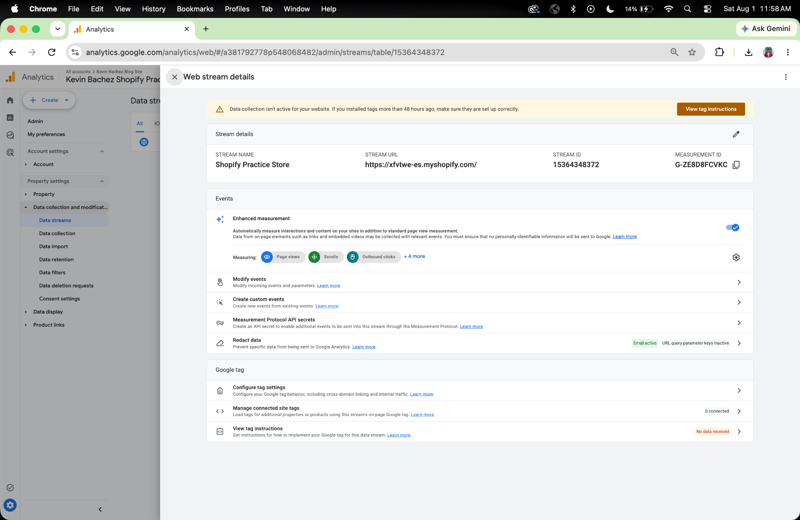
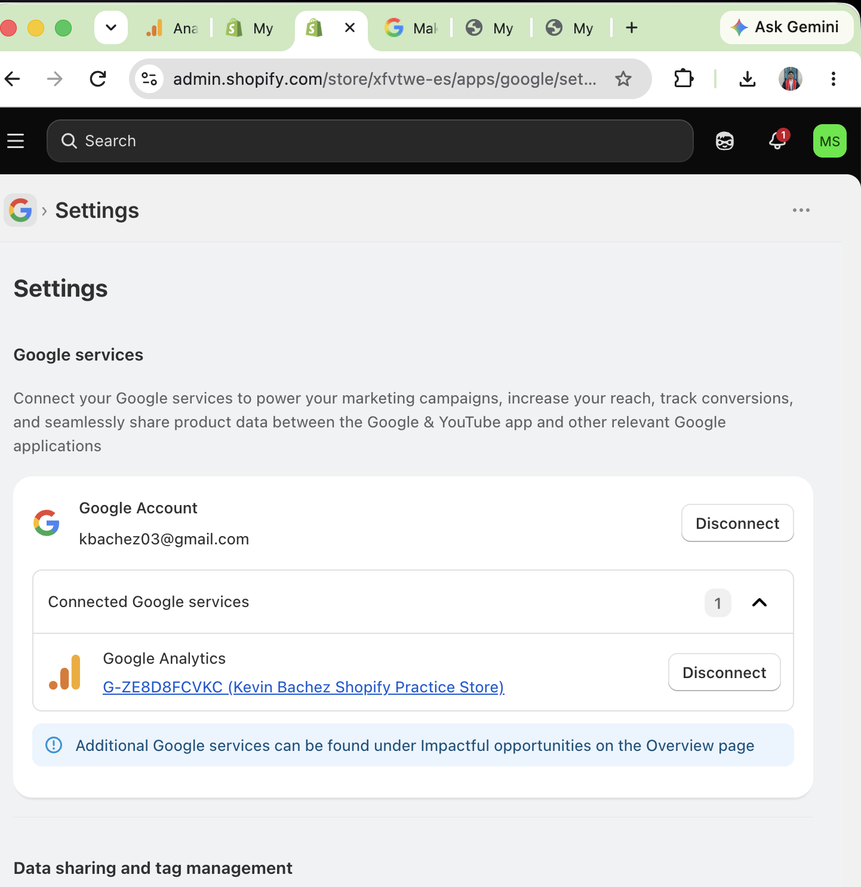
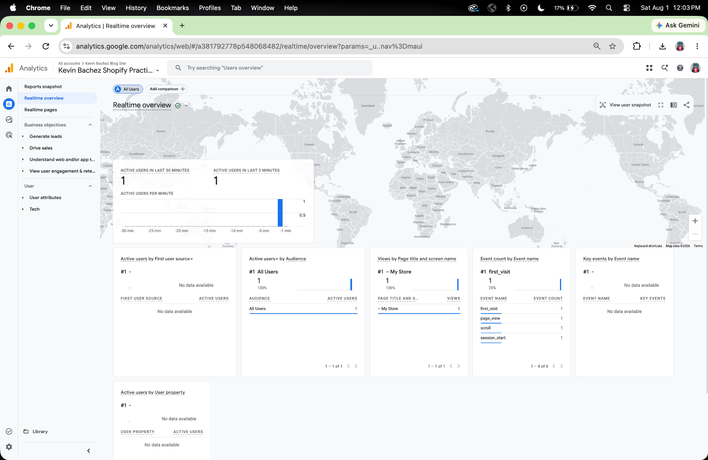

# Assignment 7: GA4 Setup and Shopify Integration

## Introduction

The purpose of this assignment was to connect my Shopify practice store to Google Analytics 4 (GA4) and verify that analytics data could be collected from my online store. Google Analytics 4 allows retailers to monitor customer behavior, website traffic, product engagement, and shopping activity. This report documents my GA4 setup, Shopify integration, analytics evidence, technical setup experience, and how analytics can benefit CPP Farm Store.

# GA4 Property / Web Stream Evidence

I created a Google Analytics 4 property for my Shopify practice store and configured a web data stream for my Shopify website. During the setup, Google Analytics generated a Measurement ID that allows the website to send customer activity data to GA4. 

The screenshot below shows the web stream details, including the stream name, website URL, stream ID, and Measurement ID.

# Shopify Connection Evidence

After creating the GA4 property, I connected Google Analytics to my Shopify practice store using the Google & YouTube sales channel. The Google Analytics property was successfully linked to my Shopify store, and conversion measurement was enabled. This connection allows Shopify to send website activity and customer interactions to Google Analytics 4 for reporting and analysis.

The screenshot below shows the successful connection between Shopify and Google Analytics.

# Analytics Evidence

After connecting Google Analytics 4 to Shopify, I visited my Shopify storefront to generate activity. I navigated through the website, viewed pages, and interacted with the store before opening the Google Analytics Realtime report.

The Realtime report showed one active user and recorded several events, including **first_visit**, **page_view**, **scroll**, and **session_start**. These events confirmed that Google Analytics 4 was successfully receiving live data from my Shopify practice store and that the integration was working correctly.

The screenshot below shows the Google Analytics Realtime report.

# Technical Issue Documentation

During the setup process, I initially received a notification indicating that data collection was not yet active because the Google Analytics tag had not been fully connected to my Shopify store. I followed Google's installation instructions and completed the setup using the Google & YouTube sales channel in Shopify. After connecting the Google Analytics property, I revisited the Google Analytics Realtime report and verified that live website activity was successfully being tracked. This confirmed that the connection had been completed successfully.

# CPP Farm Store Analytics Reflection

Google Analytics 4 and Shopify Analytics can help CPP Farm Store better understand customer behavior and improve business performance. The store can monitor website traffic, customer sessions, page views, product views, traffic sources, add-to-cart events, checkout activity, completed purchases, and customer engagement. These insights allow the Farm Store to identify popular products, evaluate the effectiveness of marketing campaigns, understand where customers leave the purchasing process, and improve the online shopping experience. Using analytics data, CPP Farm Store can make better marketing decisions, optimize its website, and increase customer satisfaction and sales.

# Appendix

## GitHub Pages

<https://kebachez.github.io/ITP-W09-Shopify-GA4/>

## GitHub Repository

<https://github.com/kebachez/ITP-W09-Shopify-GA4.git>
